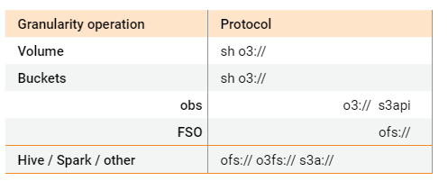

This lab is designed to go through some Ozone fundamentals such as volume bucket and key creations. 

We will also explore some Cloudera security elements and how Ozone integrates broadly with the Cloudera ecosystem and beyond with the s3 gateway interaction.

*Note: This lab is hosted on the edge2Ai 1 node deployment. It's meant for functional testing and not performance testing*

*Custodian Prerequisites*
having an internet connection  where you can ping websites hosted with open proxies. 
have a command line interface where you can perform ssh
we provide a web-ui command line interface but could be blocked by the corporate firewall from your organization
having an affinity with command line procedure
having a baseline knowledge of Cloudera product

# Lab 1 Security

**Summary**
- Enable Ranger from the Cloudera Manager UI
- SSH to the node and start using the command line
- Test Ranger privileges
- Review Ozone Security Settings from the command line

## Enable and Configure Ranger
In Cloudera Manager, go to the Ozone service.
![[ClouderaManager-Ozoneservice.png]](./images/ClouderaManager-Ozoneservice.png)

Select the Ozone Configuration tab and confirm that RANGER Service is enabled.

This integrates Ozone with Ranger security policies.

Access the Ranger Service and access the Ranger UI  
  

Select cm_ozone under the Ozone service.  

  

In the top policy listed as **all - volume, bucket and key**, click the pencil icon on the right that shows Edit when you hover over it.  


To understand the structure of the Ranger policy for Ozone, we can look at the layout for data in Ozone as well as the structure allow/deny conditions in all Ranger policies. 

Ozone Data Layout

 
Ranger - Allow and deny conditions


 
**Structure of the Ranger permissions for Ozone** 


**Test the following with users Alice and Bob**
Using the same Policy, set up to manage access over all Volume, buckets and keys:  
Volume = \*  
Bucket = \*  
Key = \*  

| Users  | Alice  | Bob  |
|--------|------|--------|
| Access |  All  |  Read/List file |
|  Deny  | None |  Create Volume |

Add users **Admin** and **Alice** to the existing "All" condition.
 
Bob's accesses:
- Click on the + button under the "Allow Conditions"
- Under “Allow” condition add “read/list” privileges for the user Bob


- Under "Deny" condition, add "create" privileges for user Bob


Double check you did add your username to the first “allow” condition (e.g. admin) to provide all privileges to your user. (you can run the entire lab under the user "admin" which is by default and for which the commands were written for simplicity. 


Scroll down to the bottom of the page and press Save.

## ssh to the node
In Mac:
ssh admin@cdp.`node ip`.nip.io

In windows
Use putty to ssh to cdp.`node ip`.nip.io

## Test Ranger privileges

Authenticate the user Bob with the Authentication Service of the KDC configured in /etc/krb5. conf
```console
kinit bob
``` 
Password: Supersecret1

Run the Ozone command to create a Volume
```console
ozone sh volume create /testperms
``` 

As Bob, user with restricted access, the expected response is:

`23/09/12 11:54:42 INFO rpc.RpcClient: Creating Volume: testperms, with bob as owner and space quota set to -1 bytes, counts quota set to -1`  
`PERMISSION_DENIED User bob@WORKSHOP.COM doesn't have CREATE permission to access volume Volume:testperms`

Switch to user Alice to create a volume and a file:
```console
kinit Alice
```
Password:Supersecret1

Try the same command as Alice:
```console
ozone sh volume create /testperms
```
List the volumes available
```console
ozone sh volume list  | jq -r '.[] | .name'
```

As Alice, user with extended access, the expected response is:
`23/09/12 12:05:18 INFO rpc.RpcClient: Creating Volume: testperms1, with alice as owner and space quota set to -1 bytes, counts quota set to -1`

Create a test file and a bucket and save the file in the bucket using parameters:
- Replication = ONE
- Replication type = RATIS

```console
echo "Test file" > testfile
ozone sh bucket create /testperms/bucket1
ozone sh key put --replication=ONE --replication-type=RATIS o3://ozone/testperms/bucket1/alice_key1 testfile
```
List the buckets avaible in volume testperms and kinit back as user admin
```console
ozone sh bucket list /testperms | jq -r '.[] | .name'
```

delete it all and kinit back as user admin
```console
ozone fs -rm -r -skipTrash ofs://ozone/testperms/bucket1/alice_key1
ozone sh bucket delete o3://ozone/testperms/bucket1
ozone sh volume delete o3://ozone/testperms
kinit admin
```

## Reviewing Ozone Security Settings

Run the following ozone getconf commands to check some Ozone Manager properties:
```console
ozone getconf -confKey ozone.om.kerberos.principal
ozone getconf -confKey ozone.om.http.auth.kerberos.principal
ozone getconf -confKey ozone.om.http.auth.kerberos.keytab
```
Expected output  
`om/_HOST@WORKSHOP.COM`  
`HTTP/_HOST@REALM`  
`/etc/security/keytabs/HTTP.keytab`  

Check Security Tokens and review the output. This is a check to verify that you have Ozone security token and to show the cluster the client is connecting to using that token: 
```console
ozone sh token get
```

Expected Output 
`Successfully get token for service 10.0.1.106:9862
Kind: OzoneToken, Service: 10.0.1.106:9862, Ident: (OzoneToken owner=admin@WORKSHOP.COM, renewer=admin, realUser=, issueDate=2023-10-02T14:19:46.272Z, maxDate=2023-10-09T14:19:46.272Z, sequenceNumber=1, masterKeyId=1, strToSign=null, signature=null, awsAccessKeyId=null, omServiceId=ozone)
Token persisted to /tmp/ozone.token successfully!` 

# Lab 2 Ozone protocol operations

### Ozone Protocols:

Ozone has multiple protocols to work with for a variety of operations. There is no ONE PROTOCOL THAT RULES THEM ALL yet.



Ozone is a multi-protocol storage system with support for the following interfaces:  
- **ofs**: Hadoop-compatible file system allows any application that expects an HDFS like interface to work against Ozone with no changes. Frameworks like Apache Spark, YARN, and Hive work against Ozone without the need for any change. 
- **s3**: Amazon’s Simple Storage Service (S3) protocol. You can use S3 clients and S3 SDK-based applications without any modifications to Ozone.  => try to avoid this protocol since all passes through the s3ateway 
- **o3fs**: A bucket-rooted Hadoop Compatible file system interface. 
- **o3**: An object store interface that can be used from the Ozone shell.

### Ozone CLIs
Ozone CLI is used to access Ozone. 
- ozone **fs** - Runs Hadoop filesystem compatible commands on FSO(File System Optimized) and LEGACY buckets. Compatible with ofs and o3fs interfaces. Supports trash implementation.
- ozone **sh** - Ozone command shell interface to access Ozone as a key-value store. Command format is: ozone sh object action url. Object can be volume/bucket/key. Compatible with o3 interface.

#### Ozone fs
Summary operations
- interact with HDFS
- interact with ozone
- create a volume
- create a bucket
- push data to a bucket
- delete data from a bucket

The Ozone client can access Ozone as a file system and as a key-value store.
When Ozone is installed with the HDFS dependency, the Ozone client library support is built into the HDFS client commands, which will therefore be available for use with Ozone.
**hdfs dfs** can also be used (if ozone is not the default fs, a URI path is needed.)

Run the following command to list the files stored in HDFS.
```console
ozone fs -ls /
```

Expected output is the list of files stored in HDFS:  
`drwxr-xr-x   - hbase hbase               0 2023-09-09 13:12 /hbase`  
`drwxr-xr-x   - hdfs  supergroup          0 2023-09-09 13:08 /ranger`  
`drwxrwxr-x   - solr  solr                0 2023-09-09 13:09 /solr-infra`  
`drwxrwxrwt   - hdfs  supergroup          0 2023-09-09 13:19 /tmp`  
`drwxr-xr-x   - hdfs  supergroup          0 2023-09-09 13:17 /user`  
`drwxr-xr-x   - hdfs  supergroup          0 2023-09-09 13:10 /warehouse`  
`drwxr-xr-x   - hdfs  supergroup          0 2023-09-09 13:10 /yarn`  

 List the current ozone file system for Ozone sid ozone:
```console
ozone fs -ls ofs://ozone/
```
Volumes are at the highest level of the Ozone file system and are used to manage buckets that store keys. Quotas and user permissions can be applied to volumes for high-level file system management.

Expected output for listing Ozone items at parent level:  
`drwxrwxrwx   - om                       0 2023-09-11 18:29 ofs://ozone/s3v`

Create a volume called vol1 and list the ozone file system to see volumes
```console
ozone fs -mkdir ofs://ozone/volfs
ozone fs -ls ofs://ozone/
```

Expected output after volume creation and list command:  
`drwxrwxrwx   - om                       0 2023-09-11 18:29 ofs://ozone/s3v`  
`drwxrwxrwx   - admin admins             0 2023-09-12 14:34 ofs://ozone/volfs`  

Create a bucket in vol1 called bucket1 and list all items under volume 1. Buckets are used to store files.
```console
ozone fs -mkdir ofs://ozone/volfs/bucketfs
ozone fs -ls ofs://ozone/volfs
```

Expected output  
`23/09/12 16:36:37 INFO rpc.RpcClient: Creating Bucket: volfs/bucketfs, with the Bucket Layout FILE_SYSTEM_OPTIMIZED,
admin as owner, Versioning false, Storage Type set to DISK and Encryption set to false`  
`drwxrwxrwx   - admin admins          0 2023-09-12 16:36 ofs://ozone/volfs/bucketfs`  

OFS mimics a traditional file system, the first two levels volume and bucket look like directories.
However, you cannot use the top level volume to store keys (files). When you add a key (file), it stores the contents of the file uploaded to Ozone under that key name. 
A key is a hybrid file name. It can be a file name stored at the root of the bucket or it can be a directory path from the bucket with a filename. 
Keys can be used to mimic a traditional file system.  It is important to note that volumes and buckets have naming restrictions and certain characters and cases are not allowed. 
Keys do not have this same limit. It is also important to note that you must have /volume/bucket for OFS.  
Files must have 2 directories at a minimum (/tmp is the only exception to be a hadoop compatible filesystem.) 
Some other notes is that EC and Encryption is at the bucket level.  
Pathing from HDFS to Ozone may change due to these restrictions!!!!  
|   | Ozone  |  HDFS |
|----|-----|-----|
|Unit of Encryption|Bucket|Directory or encryption zone|
|Dedicated DEK*|Yes, per object|Yes, per file|
|EDEK|Yes, part of metadata|Yes, part of extended file attributes|
|Transparent to Client|Yes|Yes|
|Configuration|KMS path from core-site.xml: hadoop.security.key.provider.path|KMS path from core-site.xml: hadoop.security.key.provider.path|

*For transparent encryption, we introduce a new abstraction to HDFS: the encryption zone. An encryption zone is a special directory whose contents will be transparently encrypted upon write and transparently decrypted upon read. Each encryption zone is associated with a single encryption zone key which is specified when the zone is created. Each file within an encryption zone has its own unique data encryption key (DEK). DEKs are never handled directly by HDFS. Instead, HDFS only ever handles an encrypted data encryption key (EDEK). Clients decrypt an EDEK, and then use the subsequent DEK to read and write data. HDFS datanodes simply see a stream of encrypted bytes.

Upload a file to bucket_fs:
```console
echo "Test file" > testfile
ozone fs -put testfile ofs://ozone/volfs/bucketfs
ozone fs -ls ofs://ozone/volfs/bucketfs
```

Expected output for listing content of bucket1:  
`-rw-rw-rw-   1 admin admin         10 2023-09-12 16:41 ofs://ozone/volfs/bucketfs/testfile`  


View content of the file:
```console
ozone fs -cat ofs://ozone/volfs/bucketfs/testfile
```

Let's try to upload another file to the bucket:  
```console
ozone fs -put /tmp/cloudera-scm-agent.log ofs://ozone/volfs/bucketfs
ozone fs -cat ofs://ozone/volfs/bucketfs/cloudera-scm-agent.log
```

*Note: the cloudera-scm-agent.log is available under /var/log/cloudera-scm-agent/. It can be copied over to the temp folder using root access (username: centos). *

##### Deletion
When you delete a file in Ozone using ozone fs, the file is not immediately removed from Ozone. Instead files are moved to a hidden .Trash dir (prefix dot Trash) that is user accessible under /user/<username>/.Trash/Current deleted directory. The full directory path of each user's deleted files will appear under this .Trash dir.

To bypass the trash to save disk space from keeping around files in the .Trash folder, set the -skipTrash flag to immediately delete the files bypassing the trash when you delete files.

```console
ozone fs -rm -r -skipTrash ofs://ozone/volfs/bucketfs/testfile
ozone fs -rm -r -skipTrash ofs://ozone/volfs/bucketfs/cloudera-scm-agent.log
```
Expected output  
`Deleted ofs://ozone/volfs/bucketfs/testfile`
`Deleted ofs://ozone/volfs/bucketfs/cloudera-scm-agent.log`


Clean up bucket and volume
```console
ozone sh bucket delete o3://ozone/volfs/bucketfs
ozone sh volume delete o3://ozone/volfs
```

#### Ozone sh
summary operations:
- create a volume
- create a bucket
- list operations
- get information from volume, bucket, key
- quota operations
- symlinks 
Other operations will be done in further section such as EC, replications, bucket layout type

Detailed operations:
Create a volume /volsh
```console
ozone sh volume create o3://ozone/volsh  ### or ozone sh volume create /volsh
ozone sh volume info /volsh
```
Expected output  
`  
{  
  "metadata" : { },  
  "name" : "volsh",  
  "admin" : "admin",  
  "owner" : "admin",  
  "quotaInBytes" : -1,  
  "quotaInNamespace" : -1,  
  "usedNamespace" : 0,  
  "creationTime" : "2023-04-18T03:45:41.930Z",  
  "modificationTime" : "2023-04-18T03:45:41.930Z",  
  "acls" : [ {  
     "type" : "USER",  
     "name" : "centos",  
     "aclScope" : "ACCESS",  
     "aclList" : [ "ALL" ]  
  }`  
  
Create a bucket bucketsh under /volsh
```console
ozone sh bucket create /volsh/bucketsh
ozone sh bucket info /volsh/bucketsh
```
Expected output  
`  
{  
  "metadata" : { },  
  "volumeName" : "volsh",  
  "name" : "bucketsh",   
  "storageType" : "DISK",  
  "versioning" : false,  
  "usedBytes" : 0,  
  "usedNamespace" : 0,  
  "creationTime" : "2023-04-18T03:46:37.236Z",  
  "modificationTime" : "2023-04-18T03:46:37.236Z",  
  "quotaInBytes" : -1,  
  "quotaInNamespace" : -1,  
  "bucketLayout" : "LEGACY",  
  "owner" : "admin",  
  "link" : false  
}`  

List all the volumes owned by the specified user
```console
ozone sh volume list --user=admin
ozone sh volume list --all o3://ozone
```

A variant which provides all the volumes for a dedicated user
```console
ozone sh volume list --all o3://ozone | grep -A3 'metadata' | grep 'name\|owner\|admin'
```

get information from volume, bucket, key
```console
ozone sh volume info o3://ozone/volsh
ozone sh bucket info o3://ozone/volsh/bucketsh
```

#### Quota operations
Set a quota 

Two types of quotas in Ozone:
- Storage Space quota: define how much storage space a Volume or Bucket can use (expressed in bytes, Storage space level quotas allow the use of units such as KB (k), MB (m), GB (g), TB (t), PB (p), etc.). To note: If volume’s quota is enabled then bucket’s quota cannot be cleared.
- Namespace quota: define how many namespace a Volume or Bucket can use
  - When volume namespace quota is enabled, the total number of buckets under the volume, cannot exceed the volume namespace quota
  - When bucket namespace quota is enabled, the total number of keys under the bucket, cannot exceed the bucket namespace quota.

```console
ozone sh volume setquota --namespace-quota=2 --space-quota 100MB o3://ozone/volsh
ozone sh bucket setquota --namespace-quota=10 --space-quota 100MB o3://ozone/volsh/bucketsh
ozone sh bucket info o3://ozone/volsh/bucketsh
```
Expected output: the namespace quota was set - namespace-quota mean max number of buckets or keys  
`{
  "metadata" : { },
  "volumeName" : "volsh",
  "name" : "bucketsh",
  "storageType" : "DISK",
  "versioning" : false,
  "usedBytes" : 0,
  "usedNamespace" : 0,
  "creationTime" : "2023-10-02T14:23:22.439Z",
  "modificationTime" : "2023-10-02T15:46:44.629Z",
  "quotaInBytes" : 104857600,
  "quotaInNamespace" : 10,
  "bucketLayout" : "FILE_SYSTEM_OPTIMIZED",
  "replicationConfig" : {
    "replicationFactor" : "ONE",
    "requiredNodes" : 1,
    "replicationType" : "RATIS"
  },
  "link" : false
}`

Remove a quota
```console
ozone sh volume clrquota --namespace-quota o3://ozone/volsh
ozone sh bucket clrquota --namespace-quota o3://ozone/volsh/bucketsh
ozone sh bucket info o3://ozone/volsh/bucketsh
```
`{
  "metadata" : { },
  "volumeName" : "volsh",
  "name" : "bucketsh",
  "storageType" : "DISK",
  "versioning" : false,
  "usedBytes" : 0,
  "usedNamespace" : 0,
  "creationTime" : "2023-10-02T14:23:22.439Z",
  "modificationTime" : "2023-10-02T15:45:15.715Z",
  "quotaInBytes" : -1,
  "quotaInNamespace" : 10,
  "bucketLayout" : "FILE_SYSTEM_OPTIMIZED",
  "replicationConfig" : {
    "replicationFactor" : "ONE",
    "requiredNodes" : 1,
    "replicationType" : "RATIS"
  },
  "link" : false
}
`

#### Symlinks

Symlinks are relevant when s3 operation required. You do not create a bucket within the volume srv but you symlink a bucket in it: by default, all the buckets of the /s3v volume can be accessed with S3 interface but only the (Ozone) buckets of the /s3v volumes are exposed.
To make any other buckets available with the S3 interface a “symbolic linked” bucket can be created between 2 buckets like so:  

```console
ozone sh bucket link o3://ozone/volsh/bucketsh o3://ozone/volsh/bucketsymlink
```

Ozone bucket Erasure coding  ⇒ **won't fully work on a 1 node cluster**
Ozone supports RATIS and Erasure Coding Replication types. 
Default replication type is RATIS and the replication factor is 3. Copies of container replicas are maintained across the cluster. RATIS 3 replication has 200% storage overhead.
For cold and warm data with low I/O requirement EC storage is available. 50% replication overhead. 

#### Create Erasure Coded(EC) buckets/keys

```console
ozone sh bucket create /volsh/ec5-bucket1 -t EC -r rs-3-2-1024k
ozone sh bucket info  /volsh/ec5-bucket1
```
Expected output  
`{  
  "metadata" : { },  
  "volumeName" : "volsh",  
  "name" : "ec5-bucket1",  
  "storageType" : "DISK",  
  "versioning" : false,  
  "usedBytes" : 0,  
  "usedNamespace" : 0,  
  "creationTime" : "2023-04-19T17:41:02.340Z",  
  "modificationTime" : "2023-04-19T17:41:02.340Z",  
  "quotaInBytes" : -1,  
  "quotaInNamespace" : -1,  
  "bucketLayout" : "LEGACY",  
  "owner" : "cdpuser1",  
  "replicationConfig" : {  
    "data" : 3,  
    "parity" : 2,  
    "ecChunkSize" : 1048576,  
    "codec" : "RS",  
    "replicationType" : "EC",  
    "requiredNodes" : 5  
  },  
  "link" : false  
}`  

```console
ozone sh bucket create /volsh/ec9-bucket1 -t EC -r rs-6-3-1024k
ozone sh bucket info  /volsh/ec9-bucket1
```
`{  
  "metadata" : { },  
  "volumeName" : "volsh",  
  "name" : "ec9-bucket1",  
  "storageType" : "DISK",  
  "versioning" : false,  
  "usedBytes" : 0,  
  "usedNamespace" : 0,  
  "creationTime" : "2023-04-19T17:42:03.273Z",  
  "modificationTime" : "2023-04-19T17:42:03.273Z",  
  "quotaInBytes" : -1,  
  "quotaInNamespace" : -1,  
  "bucketLayout" : "LEGACY",  
  "owner" : "cdpuser1",  
  "replicationConfig" : {  
    "data" : 6,  
    "parity" : 3,  
    "ecChunkSize" : 1048576,  
    "codec" : "RS",  
    "replicationType" : "EC",  
    "requiredNodes" : 9  
  },  
  "link" : false  
}`  

For reference:  you can update replication config for existing buckets:
```console
ozone sh bucket create /volsh/bucketrep
ozone sh bucket set-replication-config /volsh/bucketrep -t EC -r rs-3-2-1024k 
ozone sh bucket info /volsh/bucketrep
```
`{  
  "metadata" : { },  
  "volumeName" : "volsh",  
  "name" : "bucketrep",  
  "storageType" : "DISK",  
  "versioning" : false,  
  "usedBytes" : 0,  
  "usedNamespace" : 0,  
  "creationTime" : "2023-04-19T17:42:27.327Z",  
  "modificationTime" : "2023-04-19T17:42:32.026Z",  
  "quotaInBytes" : -1,  
  "quotaInNamespace" : -1,  
  "bucketLayout" : "LEGACY",  
  "replicationConfig" : {  
    "data" : 3,  
    "parity" : 2,  
    "ecChunkSize" : 1048576,  
    "codec" : "RS",  
    "replicationType" : "EC",  
    "requiredNodes" : 5  
  },  
  "link" : false  
}`  


# Lab 3 Bucket options FSO / OBS
Summary:
- 3 bucket layouts and why
- create a bucket FSO, OBS

Ozone supports multiple bucket layouts
- FILE_SYSTEM_OPTIMIZED (FSO):
  - Hierarchical file system namespace with files and directories.
  - Atomic rename/delete operations supported.
  - Recommended to be used with Hadoop file system compatible interfaces rather than s3 interfaces.
  - Awesome for Hive / Impala
  - Trash implementation.
- OBJECT_STORE (OBS):
  - Flat key-value namespace like S3.
  - Recommended to be used with S3 interfaces.
- LEGACY:
  - Provides support for existing buckets created in older versions.
  - Default behavior is compatible with the Hadoop File system. 

  
Within volsh already created, create a bucket with the FSO layout and display the information about the bucket
```console
ozone sh bucket create /volsh/fso-bucket --layout FILE_SYSTEM_OPTIMIZED
ozone sh bucket info /volsh/fso-bucket
```

Expected output  
`{  
  "metadata" : { },  
  "volumeName" : "volsh",  
  "name" : "fso-bucket",  
  "storageType" : "DISK",  
  "versioning" : false,  
  "usedBytes" : 0,  
  "usedNamespace" : 0,  
  "creationTime" : "2023-09-13T10:43:04.625Z",  
  "modificationTime" : "2023-09-13T10:43:04.625Z",  
  "quotaInBytes" : -1,  
  "quotaInNamespace" : -1,  
  "bucketLayout" : "FILE_SYSTEM_OPTIMIZED",  
  "owner" : "admin",  
  "link" : false  
}`  
Within Vol1 already created, create a bucket with the OBS layout and display the information about the bucket
```console
ozone sh bucket create /volsh/obs-bucket --layout OBJECT_STORE
ozone sh bucket info /volsh/obs-bucket
```

Expected Output  
`{  
  "metadata" : { },  
  "volumeName" : "volsh",  
  "name" : "obs-bucket",  
  "storageType" : "DISK",  
  "versioning" : false,  
  "usedBytes" : 0,  
  "usedNamespace" : 0,  
  "creationTime" : "2023-09-13T10:44:22.166Z",  
  "modificationTime" : "2023-09-13T10:44:22.166Z",  
  "quotaInBytes" : -1,  
  "quotaInNamespace" : -1,  
  "bucketLayout" : "OBJECT_STORE",  
  "owner" : "admin",  
  "link" : false  
}`  

# Lab 4 data copy HDFS ⇔ Ozone

Summary
- configure Ranger policy rules
- download dataset, push it to hdfs
- distcp operations hdfs dataset to ozone
- crc checksum validation via a spark-submit job

Prerequisites  
In Ranger (log into Ranger UI using admin/Supersecret1).  
Select cm_hdfs under the HDFS service.  
Once you are on the cm_hdfs page, edit the first policy called all-path by clicking its number or the Edit (pencil) button on the right.

Under Allow Conditions, add your admin user to the users with RWX permissions (e.g: admin)

**Save** your changes to the Ranger policy

The below command creates a bucket by default
```console
ozone fs -mkdir -p ofs://ozone/hive/warehouse/cp/vehicles
```

Copy files to the bucket
```console
ozone fs -cp hdfs:///tmp/vehicles.csv ofs://ozone/hive/warehouse/cp/vehicles
```
*Note*
Files downloaded from https://www.fueleconomy.gov/feg/epadata/vehicles.csv were copied into your tmp folder. If they are missing, ssh as root (usually user is "centos") to the node and run the below command:
*sudo yum install -y wget
wget -qO - https://www.fueleconomy.gov/feg/epadata/vehicles.csv | hdfs dfs -copyFromLocal - /tmp/vehicles.csv*

Once copied over, list the files in the Ozone bucket:
```console
ozone fs -ls ofs://ozone/hive/warehouse/cp/vehicles
```
- Using the ozone fs -cp command is a very slow way to copy files, because only a single client shell on the gateway will download and upload the files between the systems. For greater scalability, you need to have the cluster move the files in parallel, directly from the source to the destination with multiple servers.
- Copy files using the hadoop distcp command. This will submit a MapReduce application to Yarn to run a map side job that will, by default, copy the files using multiple servers (4 containers in parallel). This will be much faster than using the ozone cp command for large files, as the hard work of copying all the files is done by the whole cluster, rather than a single machine with less bandwidth when using the ozone fs cp command. Distcp is a powerful tool for moving files in parallel. It offers many options for syncing and atomically copying data, so that no file is missed even if there is an error in communication. 

```console
ozone fs -mkdir -p ofs://ozone/hive/warehouse/distcp/vehicles
hadoop distcp -m 2 -skipcrccheck hdfs:///tmp/vehicles.csv ofs://ozone/hive/warehouse/distcp/vehicles
```
Another variant: authentication -- Establishes mutual authentication between the client and the server.
```console
hadoop distcp  -Ddfs.data.transfer.protection=authentication -m 2 -skipcrccheck \ hdfs://cdp.54.170.129.255.nip.io:8020/user/admin/* ofs://ozone/my-volume1/my-bucket1
```

List the Ozone files in /tmp
```console
ozone fs -ls  ofs://ozone/hive/warehouse/distcp/vehicles
```

# Lab 5 Hive & Spark on base
Summary:
- Configure ranger policy rules
- Check that hiveServer2 has the right colocation parameters in place
- Start a spark shell session and perform some operations
- Spark shell push data
- Hive via beeline
- Hive via hue

Prerequisites:
We need to change some Ranger policy rules so hive can access the Ozone layer, Ozone Manager also needs to access H2s.
We will also check the h2s parameter to allow managed db and table on both ozone and hdfs

Give your users all privileges on HadoopSQL repo in Ranger. Open Ranger UI, access the Hadoop SQL service, add your user to all - database, table, column policy and Save.


In the same HadoopSQL tab, add your user to the "all - url" policy, this is needed for Spark


Next, provide “hive” and “yarn” user all privileges on Ozone.

On Ranger UI, go to cm_ozone repo > Edit “all - volume, bucket, key” > Provide “hive” & “yarn” users all privileges.


Check HiveServer 2 configuration:
 If we want hive managed databases and tables on both ozone and HDFS, we do need to add a parameter within hiveServer2 to make it happen.

within hive_hs2_config_safety_valve add  metastore.warehouse.tenant.colocation=true


Detailed operations:

You need to add parameter to your spark shell in order to interact with ozone
Spark-shell
Let's push some data to ozone first.
```console
ozone fs -put /var/log/hadoop-ozone/ozone-recon.log ofs://ozone/vol1/bucket1/
```

Open the Spark Shell
```console
spark-shell --conf spark.yarn.access.hadoopFileSystems=ofs://ozone
```
within Spark-shell
```scala
val dfofs=spark.read.option("header", "true").option("inferSchema", "true").csv(s"ofs://ozone/vol1/bucket1/ozone-recon.log")
dfofs.collect()
```
To exit the spark shall
```scala
:quit
```

Another example
```console
hdfs dfs -mkdir -p ofs://ozone/data/vehicles
wget -qO - https://www.fueleconomy.gov/feg/epadata/vehicles.csv | hdfs dfs -copyFromLocal - ofs://ozone/data/vehicles/vehicles.csv 
spark-shell --conf "spark.debug.maxToStringFields=90" --conf spark.yarn.access.hadoopFileSystems="ofs://ozone/" << EOF
```

```scala
val df = spark.read.format("csv").option("header", "true").load("ofs://ozone/data/vehicles/vehicles.csv")
df.createOrReplaceTempView("tempvehicle")
spark.sql("create table vehicles stored as parquet location 'ofs://ozone/data/vehicles/vehicles' as select * from tempvehicle");
EOF
```

Hive Beeline
create an external table on ozone that will be used later in CDW


Find out the the hostname for your machine
```console
hostname
```
and replace the hostname in the below command:

`beeline -u "jdbc:hive2://<hostnameX>:10000/default;principal=hive/<hostnameX>@WORKSHOP.COM;ssl=true;sslTrustStore=/opt/cloudera/security/jks/truststore.jks"`

```beeline
CREATE EXTERNAL TABLE `hive_vehicles`(
`barrels08` string,`barrelsa08` string,`charge120` string,`charge240` string,`city08` string,`city08u` string,`citya08` string,`citya08u` string,`citycd` string,`citye` string,`cityuf` string,`co2` string,`co2a` string,`co2tailpipeagpm` string,`co2tailpipegpm` string,`comb08` string,`comb08u` string,`comba08` string,`comba08u` string,`combe` string,`combinedcd` string,`combineduf` string,`cylinders` string,`displ` string,`drive` string,`engid` string,`eng_dscr` string,`fescore` string,`fuelcost08` string,`fuelcosta08` string,`fueltype` string,`fueltype1` string,`ghgscore` string,`ghgscorea` string,`highway08` string,`highway08u` string,`highwaya08` string,`highwaya08u` string,`highwaycd` string,`highwaye` string,`highwayuf` string,`hlv` string,`hpv` string,`id` string,`lv2` string,`lv4` string,`make` string,`model` string,`mpgdata` string,`phevblended` string,`pv2` string,`pv4` string,`range` string,`rangecity` string,`rangecitya` string,`rangehwy` string,`rangehwya` string,`trany` string,`ucity` string,`ucitya` string,`uhighway` string,`uhighwaya` string,`vclass` string,`year` string,`yousavespend` string,`guzzler` string,`trans_dscr` string,`tcharger` string,`scharger` string,`atvtype` string,`fueltype2` string,`rangea` string,`evmotor` string,`mfrcode` string,`c240dscr` string,`charge240b` string,`c240bdscr` string,`createdon` string,`modifiedon` string,`startstop` string,`phevcity` string,`phevhwy` string,`phevcomb` string) 
row format delimited 
fields terminated by ','
location 'ofs://ozone/hive/warehouse/distcp/vehicles';
msck repair table `hive_vehicles`;
select * from hive_vehicles limit 2;
```
Create a warehouse on Ozone
```beeline
CREATE DATABASE ozone_wh 
LOCATION 'ofs://ozone/hive/warehouse/external' 
MANAGEDLOCATION 'ofs://ozone/hive/warehouse/managed';
create table ozone_wh.test_managed (name string, value string);
show create table ozone_wh.test_managed;
```

Expected output  

|                   createtab_stmt                   |
|----------------------------------------------------|
| CREATE TABLE ozone_wh.test_managed(                |
|   name string,                                     |
|   value string)                                    |
| ROW FORMAT SERDE                                   |
|   'org.apache.hadoop.hive.ql.io.orc.OrcSerde'      |
| STORED AS INPUTFORMAT                              |
|   'org.apache.hadoop.hive.ql.io.orc.OrcInputFormat'|
| OUTPUTFORMAT                                       |
|  'org.apache.hadoop.hive.ql.io.orc.OrcOutputFormat'|
| LOCATION                                           |
|   'ofs://ozone/hive/warehouse/managed/test_managed'|
| TBLPROPERTIES (                                    |
|   'bucketing_version'='2',                         |
|   'transactional'='true',                          |
|   'transactional_properties'='default',            |
|   'transient_lastDdlTime'='1694622963')            |

Still in beeline type:
```beeline
insert into ozone_wh.test_managed values ('foo1', 'bar1');
create external table ozone_wh.test_external (name string, value string);
show create table ozone_wh.test_external;
```
Expected output  

|                   createtab_stmt                           |
|------------------------------------------------------------|
| CREATE EXTERNAL TABLE ozone_wh.test_external(              |
|   name string,                                             |
|   value string)                                            |
| ROW FORMAT SERDE                                           |
|   'org.apache.hadoop.hive.serde2.lazy.LazySimpleSerDe'     |
| STORED AS INPUTFORMAT                                      |
|   'org.apache.hadoop.mapred.TextInputFormat'               |
| OUTPUTFORMAT                                               |
|'org.apache.hadoop.hive.ql.io.HiveIgnoreKeyTextOutputFormat'|
| LOCATION                                                   |
|   'ofs://ozone/hive/warehouse/external/test_external'      |
| TBLPROPERTIES (                                            |
|   'bucketing_version'='2',                                 |
|   'transient_lastDdlTime'='1694623601')                    |

```beeline
insert into ozone_wh.test_external values ('foo1', 'bar1');
```

Expected output  


|        VERTICES      MODE        STATUS  TOTAL  COMPLETED  RUNNING  PENDING  FAILED  KILLED | 
|---------------------------------------------------------------------------------------------|
|Map 1 .......... container     SUCCEEDED      1          1        0        0       0       0 |
|Reducer 2 ...... container     SUCCEEDED      1          1        0        0       0       0  9, numFilesErasureCoded=0]|
|VERTICES: 02/02  [==========================>>] 100%  ELAPSED TIME: 6.65 s|

`1 row affected (7.096 seconds)`  

Exit the beeline and display the content of the managed hive warehouse in ozone 
```console
 ozone fs -ls -R ofs://ozone/hive/warehouse/managed
```

Expected output  
`drwxrwxrwx   - admin admin          0 2023-09-13 16:36 ofs://ozone/hive/warehouse/managed/test_managed`  
`drwxrwxrwx   - admin admin          0 2023-09-13 16:46 ofs://ozone/hive/warehouse/managed/test_managed/delta_0000001_0000001_0000`  
`-rw-rw-rw-   1 admin admin        741 2023-09-13 16:46 ofs://ozone/hive/warehouse/managed/test_managed/delta_0000001_0000001_0000/bucket_00000_0`  

Now display the content of the external Hive warehouse in Ozone
```console
ozone fs -ls -R ofs://ozone/hive/warehouse/external
```
Expected output  
`drwxrwxrwx   - admin admin          0 2023-09-13 16:46 ofs://ozone/hive/warehouse/external/test_external`  
`-rw-rw-rw-   1 admin admin         10 2023-09-13 17:01 ofs://ozone/hive/warehouse/external/test_external/000000_0`  

Create managed table on ozone
Reopen the beeline shell  
`beeline -u "jdbc:hive2://<hostnameX>:10000/default;principal=hive/<hostnameX>@WORKSHOP.COM;ssl=true;sslTrustStore=/opt/cloudera/security/jks/truststore.jks"`

and run
```beeline
CREATE DATABASE testofs LOCATION 'ofs://ozone/user/alice-db/testofs-ext' MANAGEDLOCATION 'ofs://ozone/user/alice-db/testofs-managed' ;
```
